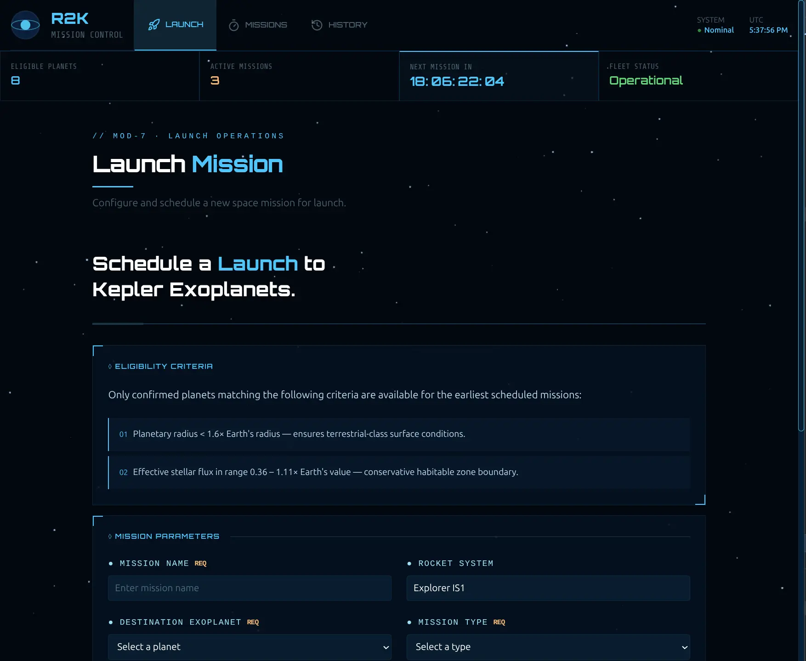
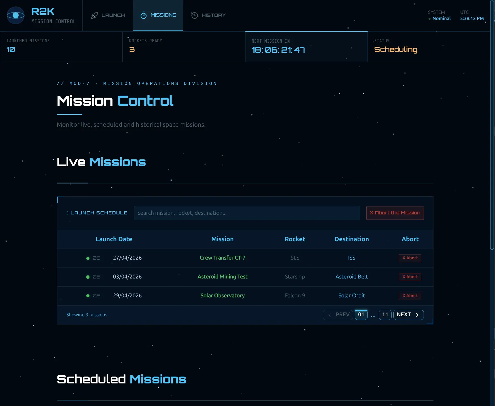
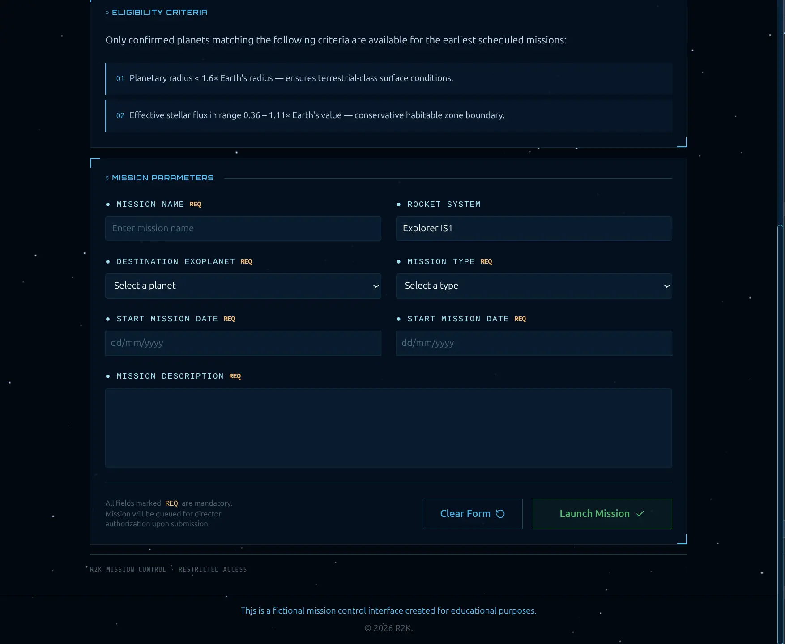
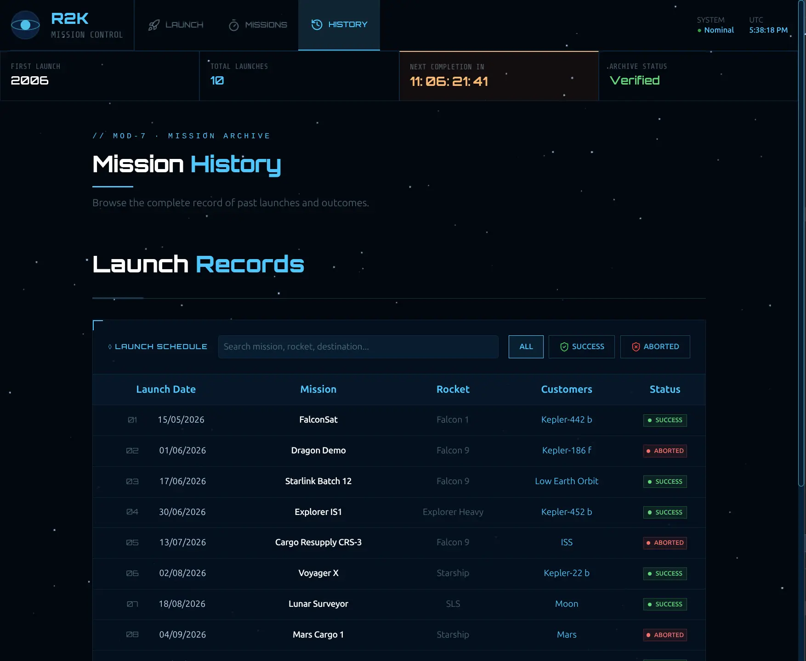

## 🚀 R2K Mission Control

A futuristic mission control dashboard built with React, TypeScript, and Tailwind CSS, simulating a space operations system with live, scheduled, and historical missions.

It features server-like pagination via URL state, advanced filtering, search, and a highly interactive UI inspired by space mission control systems.

## ✨ Preview

<table>
  <tr>
    <td></td>
    <td></td>
  </tr>
  <tr>
    <td></td>
    <td></td>
  </tr>
</table>

## 🎯 Features

- 🚀 Live, Scheduled and History mission dashboards
- 🔎 Search with debounced input
- 🧠 Filter system (status-based filtering)
- 📄 Server-side style pagination via URL
- 🔗 Fully synced URL state (search, filter, page)
- ⚡ Optimized rendering with React hooks
- 🎨 Custom space-themed UI design
- 🧩 Reusable UI components system
- 💬 Toast system for mission actions (abort, status update)

## 🧠 Backend

This project is designed to support a fullstack architecture using:

- Node.js and Express (REST API)
- Prisma ORM
- MongoDB database

The backend is responsible for:

- 📦 Missions data persistence
- 🔍 Filtering and search queries
- 📄 Server-side pagination
- ⚙️ Status management (live, scheduled, completed).
